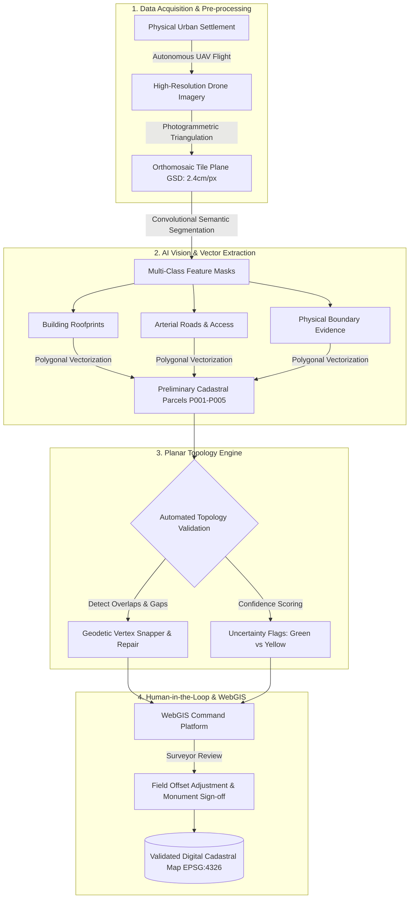

# PS12 — AI-Based Automated Urban Parcel Mapping & Cadastral Feature Extraction System using Drone Imagery

<div align="center">


**An interactive 3D WebGIS Digital Twin and AI-Assisted Geospatial Intelligence Prototype for Automated Urban Cadastre, Planar Topology Enforcement, and Human-in-the-Loop Surveyor Verification.**

[Live Demo](#-quick-start--local-development) • [System Architecture](#-system-architecture) • [Cinematic Scenes](#-the-12-scene-cinematic-pipeline) • [GIS Pipeline](#-canonical-gis-data-architecture) • [Topology Rules](#-planar-topology-validation-engine)

</div>

---

> [!IMPORTANT]
> **Statutory Cadastral & Legal Disclaimer:**
> This software is a prototype research visualization designed for the **Smart India Hackathon (SIH) 2026**. All automated outputs, extracted building rooflines, physical boundaries, and parcel geometries generated by the AI vision pipeline are strictly designated as **AI-Assisted Preliminary Results Requiring Field Surveyor Validation**. 
>
> In accordance with national land administration protocols (such as Digital India Land Records Modernization Programme — DILRMP and Survey of India guidelines), **AI does NOT legally establish property ownership or independently determine legal boundaries**. The system functions as a high-precision decision-support tool for licensed cadastral surveyors and municipal authorities.

---

## 📋 Executive Overview

Rapid, unplanned urbanization creates dense informal settlements characterized by irregular plot layouts, narrow unmapped corridors, and ambiguous physical boundaries. Traditional cadastral surveys relying solely on manual total station measurements and physical chain surveys suffer from severe bottlenecks:
- **Prolonged Fieldwork**: Mapping complex urban wards manually requires weeks or months per square kilometer.
- **Boundary Ambiguity**: Inconclusive physical demarcations (informal fences, hedges, shared compound walls) trigger persistent land disputes.
- **Topological Inconsistencies**: Manual digitizing frequently introduces self-intersections, overlapping claims, and sliver gaps.
- **Absence of 3D Integration**: Modern multi-storey vertical tenure cannot be adequately captured by legacy 2D paper maps.

**The PS12 Solution** provides an end-to-end, data-driven 3D WebGIS platform that bridges high-resolution UAV drone photogrammetry with deep convolutional feature extraction, rigorous computational topology rules, and an intuitive human-in-the-loop field verification workflow.

---

## 🏛️ System Architecture

The following diagram illustrates the complete transition from raw physical space to validated municipal cadastral records:



---

## 🎬 The 12-Scene Cinematic Pipeline

The platform features an automated, director-grade cinematic walkthrough explaining the complete cadastral workflow across 12 choreographed scenes:

| Scene | Phase Badge | Stage Title | Core 3D Visualization & Technical Behavior |
| :---: | :---: | :--- | :--- |
| **01** | `PHYSICAL SPACE` | **The Urban Landscape** | High aerial establishing panorama descending over Ward 14 (Kengeri Urban Sector) showing multi-storey buildings, irregular plots, and narrow access corridors in natural daylight. |
| **02** | `CADASTRAL CHALLENGE` | **The Cadastral Bottleneck** | Simulation of traditional surveying limitations: 3D Total Station instruments, animated laser measuring rays, dispute callout markers, and compound wall boundary ambiguities. |
| **03** | `DATA ACQUISITION` | **High-Precision UAV Survey** | Autonomous surveying quadcopter flying an automated lawnmower grid pattern with spinning rotors, sensor gimbal, and a volumetric downward scanning cone ($2.4\,\text{cm/px}$ GSD). |
| **04** | `SPATIAL PREPROCESSING` | **High-Resolution Aerial Imagery** | Calibrated true-orthomosaic tile plane projected on the national geodetic reference frame (EPSG:4326 / WGS 84), featuring pixel matrix inspection grids. |
| **05** | `AI INFERENCE` | **AI Vision Feature Extraction** | Sweeping laser scanner progressively reveals multi-class semantic segmentation masks: building footprints (cyan), arterial roads (charcoal), corridors (orange), and boundary markers (amber). |
| **06** | `VECTORIZATION` | **Building Footprint Detection** | **Hero Feature**: Detailed multi-storey urban building cluster (B-001 through B-004). Laser scan sweeps across the architecture; cyan outline traces the perimeter in real time; footprint separates into an elevated 3D vector GIS polygon with `HIGH CONFIDENCE` badges. |
| **07** | `CADASTRAL GENERATION` | **Preliminary Parcel Generation** | Preliminary parcel polygons (P001–P005) materialize with cyan perimeter boundaries, area calculations ($m^2$), and statutory *"AI-Assisted Preliminary Map"* status chips. |
| **08** | `QUALITY ASSURANCE` | **Uncertainty & Risk Detection** | Categorical risk delineation: unambiguous physical walls marked in **Green** (`High Confidence`), ambiguous fences marked in **Yellow** with pulsating *"Surveyor Field Review Required"* warning flags. |
| **09** | `GIS INTEGRITY` | **Planar Topology Validation & Repair** | Automated topology audit: identifies parcel overlaps in **Red** and sliver gaps in **Amber**, followed by an automated vertex snap demonstrating `✓ CLOSED POLYGONS`, `✓ NO OVERLAPS`, `✓ NO GAPS`. |
| **10** | `CADASTRAL GIS` | **Web-GIS Command Platform** | Full WebGIS operator interface: dynamic layer controls, interactive parcel dossiers ($P001: 1,284\,\text{m}^2$), GeoJSON import/export, and administrative action triggers. |
| **11** | `HUMAN-IN-THE-LOOP` | **Surveyor Verification** | Interactive field adjustment simulation: licensed surveyor detects $+0.80\,\text{m}$ offset to a physical stone monument, clicks *"ALIGN & VERIFY"*, transforming uncertain yellow boundaries into solid green verified geometry. |
| **12** | `DIGITAL CADASTRE` | **Digital Cadastral City** | Grand aerial panoramic finale showcasing the complete digital cadastre with all validated parcels, vector footprints, roads, and interactive pipeline flow diagrams. |

---

## 🌐 Canonical GIS Data Architecture

The application is built on a strict, single-source-of-truth GIS architecture located in [`src/data/gis/`](file:///d:/PS12_CADASTRAL_3D/src/data/gis/):

```
src/data/gis/
├── buildings.geojson         # Extracted building footprints with height, floors, & plinth area
├── roads.geojson             # Arterial road network with dual lanes and curbs
├── accessCorridors.geojson   # Narrow unpaved access lanes connecting informal plots
├── boundaryEvidence.geojson  # Visible physical features (compound walls, fences, survey markers)
├── parcelsPreliminary.geojson# Preliminary AI-derived land parcel polygons (P001 - P005)
├── parcelsValidated.geojson  # Legally verified parcel polygons post surveyor sign-off
└── index.js                  # Geodetic coordinate conversion & data accessors
```

### Geodetic Coordinate Conversion
The system performs real-time bidirectional projection between **WGS 84 (EPSG:4326)** longitude/latitude coordinates and local 3D metric Cartesian coordinates $(X, Y, Z)$:

$$\text{Longitude} = \text{OriginLon} + \frac{X}{\text{MetersPerDegreeLon}}$$

$$\text{Latitude} = \text{OriginLat} - \frac{Z}{\text{MetersPerDegreeLat}}$$

---

## 🔬 AI Inference Pipeline & Confidence Engine

Located in [`src/ai/`](file:///d:/PS12_CADASTRAL_3D/src/ai/), the simulated AI inference pipeline embodies realistic geospatial deep-learning principles:

- **Semantic Multi-Class Segmentation**: Delineates four distinct spatial classes:
  - `Building Footprints`: Orthogonalized roof structures with plinth metrics.
  - `Road Infrastructure`: Arterial transit corridors with standardized setbacks.
  - `Access Corridors`: Informal pathways and rights-of-way.
  - `Physical Boundary Evidence`: Visible walls, fencing, and monument stones.
- **Categorical Confidence Model**:
  - `HIGH`: Unambiguous physical evidence with distinct edge gradients (e.g., masonry compound wall).
  - `MEDIUM_REVIEW`: Partial occlusion (tree canopy, shadow) requiring desktop verification.
  - `UNCERTAIN_SURVEY_REQUIRED`: Disputed or ambiguous physical division requiring mandatory field visit.
- **Zero Hallucination Disclaimer**: Demonstrates authentic confidence scoring without fabricating unverifiable ML metrics (such as synthetic IoU or false precision/recall figures).

---

## 📐 Planar Topology Validation Engine

Cadastral maps require rigorous topological correctness. The PS12 topology validator enforces four non-negotiable geometric invariants:

1. **Closed Polygon Topology**: All parcel boundary rings must close with identical start and end vertices ($V_0 = V_n$).
2. **Mutual Exclusivity (No Overlaps)**: No two parcels may occupy the same spatial area:
   $$\text{Area}(P_A \cap P_B) = 0 \quad \forall A \neq B$$
3. **Spatial Continuity (No Sliver Gaps)**: Shared parcel boundaries must share coincident vertices without unmapped dead space between registered properties.
4. **Access Right-of-Way Compliance**: Parcels must not encroach upon arterial roads or gazetted access corridors.

In **Scene 09**, the engine actively visualizes geometric repair through automated geodetic vertex snapping, eliminating gaps and trimming overlaps.

---

## 🛠️ Technology Stack

| Domain | Technologies & Libraries |
| :--- | :--- |
| **Core Framework** | **React 19**, **Vite 8**, **JavaScript (ESModules)** |
| **3D Engine & WebGL** | **Three.js (r186)**, **@react-three/fiber (v9)**, **@react-three/drei (v10)** |
| **Choreography & Motion** | **GSAP 3** (Multi-waypoint camera timelines), **Framer Motion 13** (HUD animation) |
| **Geospatial & Analysis** | **Turf.js (@turf/turf v7)**, **GeoJSON (RFC 7946)**, **Local Tangent Plane CRS** |
| **UI Design & Styling** | **Tailwind CSS v3.4**, Dark Glassmorphism, **Lucide React Icons** |
| **Typography** | *Plus Jakarta Sans*, *JetBrains Mono* (via Google Fonts) |
| **Quality & Linting** | **Oxlint** (0 errors, 0 warnings across all 52 modules) |

---

## 🎮 Navigation & Viewport Controls

The platform features two distinct viewing modes:

### 1. Cinematic Mode (Default)
- **Automated Pacing**: Sequences through all 12 scenes with smooth camera easing.
- **Playback Controls**: Play, Pause, Next Scene, Previous Scene, and Scene Scrubbing (1–12).
- **Scene Titles**: Animated contextual overlays displaying stage numbers, technical subtitles, and statutory notes.

### 2. Explore Mode (Interactive Inspection)
- **Free Orbit Controls**:
  - `Left Click + Drag`: Rotate camera around the focal center.
  - `Right Click + Drag`: Pan across the terrain.
  - `Scroll Wheel`: Smooth zoom in and out.
- **WebGIS Inspector**: Click on any parcel polygon to view legal dossier, boundary confidence, owner record, and plinth area.
- **Interactive AI Staging**: Manually step through the 8 stages of AI inference from raw imagery to surveyor sign-off.

---

## 📂 Project Directory Structure

```
d:/PS12_CADASTRAL_3D/
├── public/                     # Static icons, favicons, and manifest
├── scripts/
│   └── generate_canonical_gis.js # Canonical GeoJSON dataset generator
├── src/
│   ├── ai/                     # AI inference engine, confidence model, & segmentation
│   │   ├── confidenceModel.js
│   │   ├── featureExtraction.js
│   │   ├── index.js
│   │   ├── inferenceEngine.js
│   │   └── segmentationPipeline.js
│   ├── components/
│   │   ├── Buildings/          # Extracted building vector highlights & trace animations
│   │   ├── Camera/             # GSAP Camera Director with multi-stage waypoints
│   │   ├── City/               # Procedural 3D city architecture, roads, & vegetation
│   │   ├── Drone/              # Photogrammetric drone model with spinning rotors & scan beam
│   │   ├── GIS/                # Orthomosaic plane, AI feature masks, & spatial grid
│   │   ├── HUD/                # WebGIS interface, topology widget, & cinematic titles
│   │   ├── Parcels/            # Preliminary, uncertainty, and validated parcel polygons
│   │   └── Scene/              # CinematicCanvas & SceneLayerManager
│   ├── data/
│   │   ├── gis/                # Canonical GeoJSON datasets (buildings, roads, parcels)
│   │   ├── cadastralData.js
│   │   ├── cityData.js
│   │   └── parcelData.js
│   ├── utils/
│   │   ├── gisUtils.js         # Bidirectional coordinate conversion & spatial math
│   │   └── recordingUtils.js   # Client-side canvas screen recording
│   ├── App.jsx                 # Top-level state coordinator & scene lifecycle
│   ├── index.css               # Global Tailwind CSS and typography tokens
│   └── main.jsx                # Application root entry point
├── package.json
├── tailwind.config.js
└── vite.config.js
```

---

## 🚀 Quick Start & Local Development

### Prerequisites
- **Node.js**: v18.0.0 or higher
- **npm**: v9.0.0 or higher

### Installation & Run

```bash
# 1. Clone the repository
git clone https://github.com/saisrinath-kotta/SIH26012.git
cd SIH26012

# 2. Install dependencies
npm install --legacy-peer-deps

# 3. Start local development server
npm run dev
```

Open your browser and navigate to **`http://localhost:5173/`**.

### Quality & Production Build

```bash
# Run ultra-fast linter (zero warnings, zero errors)
npm run lint

# Build optimized production bundle
npm run build

# Preview production build locally
npm run preview
```

---

## 👥 Smart India Hackathon (SIH) 2026

- **Problem Statement ID**: **PS12**
- **Domain**: AI-Based Automated Urban Parcel Mapping and Cadastral Feature Extraction System using Drone Imagery
- **Repository**: [https://github.com/saisrinath-kotta/SIH26012.git](https://github.com/saisrinath-kotta/SIH26012.git)

---

<div align="center">
Developed with ❤️ for <b>Smart India Hackathon 2026</b>
</div>
